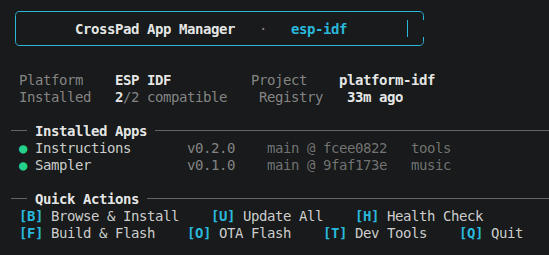

# CrossPad App Registry

Central registry of available CrossPad applications. Auto-discovered from GitHub repos with the `crosspad-app` topic, plus external repos listed in `external-apps.json`.

> **Want to publish your app?** See [How It Works](#how-it-works) for setup instructions.

## Latest Updates

<!-- LATEST_UPDATES_START -->
- **Sequencer v0.2.0** — Pad logic refactor, portable UI components
- **Sampler v0.2.0** — Wire SamplerPadLogic, EventBus audio bridge, kit load task, end=0 normalization
- **Instructions v0.2.0** — Cross-platform support — ESP-IDF, Arduino, PC
- **Synthesizer v0.1.0** — Initial release — 3 oscillators, ADSR, delay + reverb effects
- **Sequencer v0.1.0** — Initial release — step sequencer with MIDI recording
- **Serial Monitor v0.1.0** — Initial release — live UART output, input field, baud config
<!-- LATEST_UPDATES_END -->

## CrossPad Official

<!-- APP_TABLE_START -->
| App | Version | Description | Platforms | Requires | Repo |
|-----|---------|-------------|-----------|----------|------|
| **App Store** | 0.1.0 | Browse, install, and manage CrossPad apps from the registry | pc | core >=0.3.0, gui >=0.2.0 | [CrossPad/crosspad-appstore](https://github.com/CrossPad/crosspad-appstore) |
| **Instructions** | 0.2.0 | Markdown-based instructions and help viewer | esp-idf, arduino, pc | core >=0.3.0, gui >=0.2.0 | [CrossPad/crosspad-instructions](https://github.com/CrossPad/crosspad-instructions) |
| **Mixer** | 0.1.0 | Audio mixer/router with VU meters, routing matrix, channel strips | pc | core >=0.3.0, gui >=0.2.0 | [CrossPad/crosspad-mixer](https://github.com/CrossPad/crosspad-mixer) |
| **Piano** | 0.1.0 | Synth piano with parameter sliders, presets, octave control | pc | core >=0.3.0, gui >=0.2.0 | [CrossPad/crosspad-piano](https://github.com/CrossPad/crosspad-piano) |
| **Sampler** | 0.2.0 | Sample player with 16 pads, waveform editing, kit management | esp-idf, arduino | core >=0.3.0, gui >=0.2.0 | [CrossPad/crosspad-sampler](https://github.com/CrossPad/crosspad-sampler) |
| **Sequencer** | 0.2.0 | MIDI step sequencer with recording, playback, overdub | arduino | core >=0.3.0, gui >=0.2.0 | [CrossPad/crosspad-sequencer](https://github.com/CrossPad/crosspad-sequencer) |
| **Serial Monitor** | 0.1.0 | UART serial monitor with baud rate selection, auto-scroll, clear | pc | core >=0.3.0, gui >=0.2.0 | [CrossPad/crosspad-serial-monitor](https://github.com/CrossPad/crosspad-serial-monitor) |
| **Synthesizer** | 0.1.0 | Polyphonic synth with 3 oscillators, ADSR, filter, effects | arduino | core >=0.3.0, gui >=0.2.0 | [CrossPad/crosspad-synthesizer](https://github.com/CrossPad/crosspad-synthesizer) |

*8 official app(s)*
<!-- APP_TABLE_END -->

## Top 10 Community Apps

<!-- COMMUNITY_TOP_START -->
*No community apps yet — [add yours!](external-apps.json)*
<!-- COMMUNITY_TOP_END -->

---

## Using the App Manager

The CrossPad App Manager is a shared tool that works across all platforms. It provides both a **CLI** and an **interactive TUI** for managing apps — browsing, installing, removing, updating, building, and flashing.

### Supported Platforms

| Platform | Status | App install dir | Build system |
|----------|--------|----------------|--------------|
| **ESP-IDF** | Full support | `components/` | `idf.py` |
| **Arduino / PlatformIO** | Full support | `lib/` | `pio` |
| **PC (Desktop)** | Coming soon | `components/` | CMake |

### Prerequisites

- **`gh` CLI** installed and authenticated (`gh auth login`)
- **Git** (apps are installed as git submodules)
- **Python 3.9+**

---

## ESP-IDF

### CLI Commands

```bash
idf.py app-list                              # List compatible apps
idf.py app-list --all                        # Include incompatible platform apps
idf.py app-install --app sampler             # Install app as git submodule
idf.py app-install --app sampler --ref v1.0  # Install specific version/branch
idf.py app-install --app sampler --force     # Install despite platform incompatibility
idf.py app-remove --app sampler              # Remove app submodule
idf.py app-update --app sampler              # Update to latest
idf.py app-update --all                      # Update all installed apps
idf.py app-sync                              # Sync manifest with existing submodules
idf.py app-manage                            # Launch interactive TUI
```

### Interactive TUI

Launch with `idf.py app-manage` or via the VSCode toolbar button.



**Dashboard** — project overview with installed apps, quick actions via hotkeys:
- `[B]` Browse & Install — categorized app browser with `/` search
- `[U]` Update All — update all installed apps
- `[H]` Health Check — submodule status, manifest sync, gh auth, cache age
- `[F]` Build & Flash — idf.py build/flash/monitor with auto-detected serial port
- `[O]` OTA Flash — one-click OTA with build state awareness (detects stale builds)
- `[T]` Dev Tools — force refresh registry, view raw data, clear cache
- `[Q]` Quit

**App Browser** features:
- Categorized view (music, audio, tools)
- Live search with `/` key
- Color-coded status: green = installed, gray = available, red = incompatible
- `Enter` for app details, `i` to install, `r` to remove

**App Detail** shows description, platforms, dependencies, disk usage, recent git commits, changelog (fetched from GitHub), with direct actions (install/remove/update/open repo).

**OTA Flash** checks build state before flashing:
- Shows binary size, build age
- Warns if sources have been modified since last build
- `[Enter]` Flash, `[B]` Build first, `[R]` Build + Flash combo

### VSCode Toolbar Buttons

Install the [VsCode Task Buttons](https://marketplace.visualstudio.com/items?itemName=spencerwmiles.vscode-task-buttons) extension. Two buttons appear in the status bar:

| Button | Action |
|--------|--------|
| `$(package) CP Tools` | Opens the full interactive TUI |
| `$(zap) OTA` | One-click OTA flash via USB CDC |

Configuration is in `.vscode/settings.json`:

```json
{
    "VsCodeTaskButtons.tasks": [
        {
            "label": "$(package) CP Tools",
            "task": "CrossPad: CP Tools"
        },
        {
            "label": "$(zap) OTA",
            "task": "CrossPad: OTA Flash"
        }
    ]
}
```

### After Install/Remove

**`idf.py fullclean && idf.py build` is required** after adding or removing apps. CMake's `file(GLOB)` runs at configure time only — plain `idf.py build` won't discover new app directories.

---

## Arduino / PlatformIO

### CLI Commands

```bash
python3 scripts/app_manager.py list                  # List compatible apps
python3 scripts/app_manager.py install sampler        # Install
python3 scripts/app_manager.py remove sampler         # Remove
python3 scripts/app_manager.py update --all           # Update all
python3 scripts/app_manager.py sync                   # Sync manifest
python3 scripts/app_manager.py                        # Launch TUI (no args)
```

### Interactive TUI

Launch with `python3 scripts/app_manager.py` (no arguments) or via the VSCode toolbar button.

Same features as ESP-IDF TUI — dashboard, browser, detail view, build & flash (using `pio` commands), OTA, health check, dev tools.

### VSCode Toolbar Button

Same setup as ESP-IDF — install [VsCode Task Buttons](https://marketplace.visualstudio.com/items?itemName=spencerwmiles.vscode-task-buttons), then configure in `.vscode/settings.json`:

```json
{
    "VsCodeTaskButtons.tasks": [
        {
            "label": "$(package) CP Tools",
            "task": "CrossPad: App Manager"
        }
    ]
}
```

### After Install/Remove

```bash
pio run --target clean && pio run
```

---

## PC (Desktop) — Coming Soon

Desktop platform support is planned. The app manager core (`crosspad_app_manager.py`) already supports a `pc` platform config. Stay tuned.

---

## How It Works

1. Each app repo has the GitHub topic `crosspad-app` and contains a `crosspad-app.json` with metadata
2. CI runs `build_registry.py` every 6 hours which:
   - Discovers all repos with the `crosspad-app` topic in the CrossPad org
   - Merges in any external repos from `external-apps.json`
   - Generates `registry.json` + updates this README
   - Sends Discord notifications for new apps, platform additions, and version updates
3. The result is `registry.json` — fetched by the app manager (cached locally for 1 hour)
4. Apps are installed as **git submodules** into the platform's library directory
5. The build system auto-discovers installed components at configure time

### Architecture

```
crosspad-apps/                    ← This repo (registry + shared core)
  registry.json                   ← Auto-generated, consumed by app manager
  crosspad_app_manager.py         ← Shared core (downloaded by platform wrappers)
  build_registry.py               ← CI: discovers repos, builds registry
  diff_registry.py                ← CI: detects changes for Discord notifications

platform-idf/                     ← ESP-IDF platform repo
  idf_ext.py                      ← Registers idf.py app-* commands
  tools/app_manager.py            ← Thin wrapper, auto-downloads shared core
  apps.json                       ← Local manifest of installed apps

ESP32-S3/                         ← Arduino platform repo
  scripts/app_manager.py          ← Thin wrapper, auto-downloads shared core
  apps.json                       ← Local manifest of installed apps
```

## Adding a CrossPad Org App

1. Add `crosspad-app.json` to your app repository:
   ```json
   {
     "name": "My App",
     "id": "my-app",
     "version": "0.1.0",
     "description": "What it does",
     "category": "music",
     "icon": "my-icon.png",
     "component_path": "components/crosspad-my-app",
     "platforms": ["esp-idf", "arduino"],
     "requires": {
       "crosspad-core": ">=0.3.0",
       "crosspad-gui": ">=0.2.0"
     },
     "changelog": [
       "0.1.0: Initial release"
     ]
   }
   ```

2. Add the `crosspad-app` topic to your repo:
   ```bash
   gh repo edit CrossPad/crosspad-my-app --add-topic crosspad-app
   ```

3. CI will auto-discover your app on next run (every 6h), or trigger manually.

## Adding an External (Community) App

For repos outside the CrossPad org, open a PR adding your repo to `external-apps.json`:

```json
{
  "repo": "your-user/your-crosspad-app",
  "url": "https://github.com/your-user/your-crosspad-app.git",
  "branch": "main"
}
```

Your repo must also contain a `crosspad-app.json` with valid metadata.

## Files

| File | Purpose |
|------|---------|
| `registry.json` | Auto-generated registry (consumed by app manager) |
| `crosspad_app_manager.py` | Shared core — all app management + TUI logic |
| `build_registry.py` | CI: discovers repos by topic, builds registry |
| `diff_registry.py` | CI: compares registries, outputs changes for notifications |
| `external-apps.json` | Community/third-party app repos (add via PR) |
| `COMMUNITY_APPS.md` | Auto-generated full list of community apps |