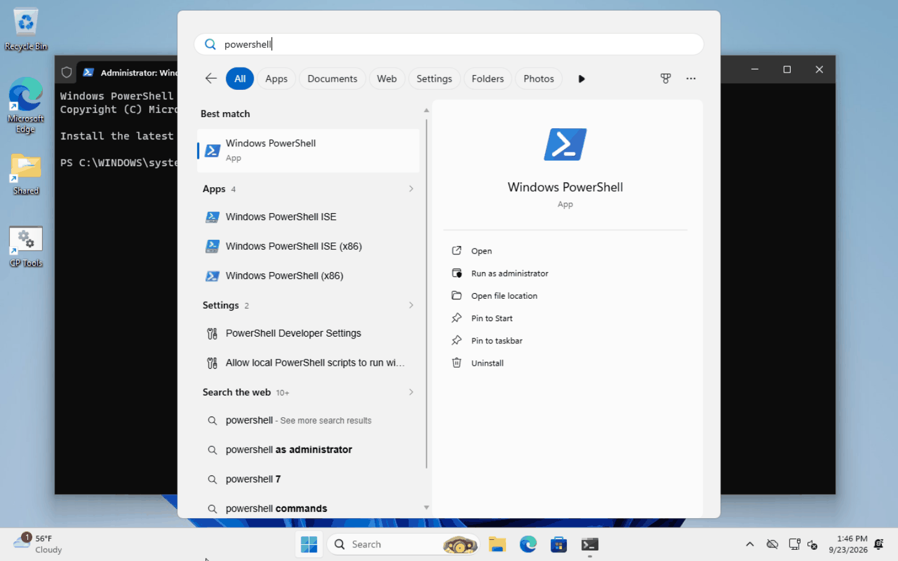
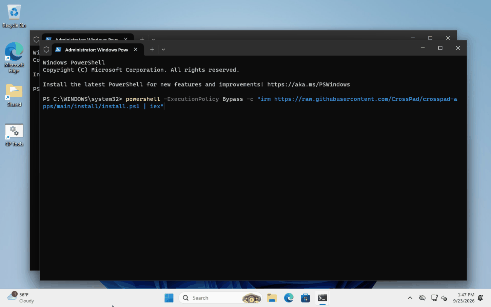
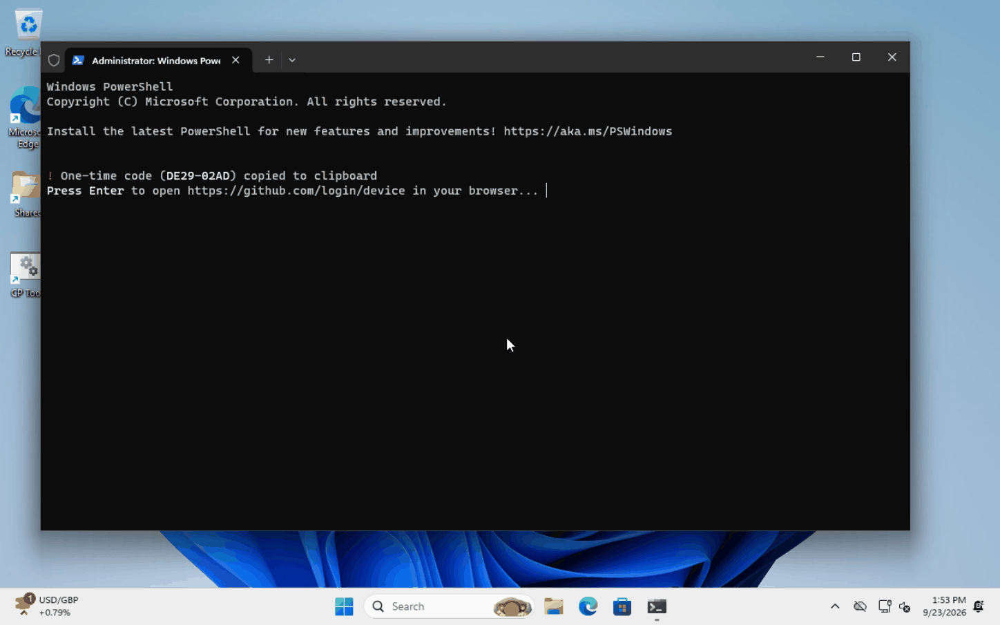
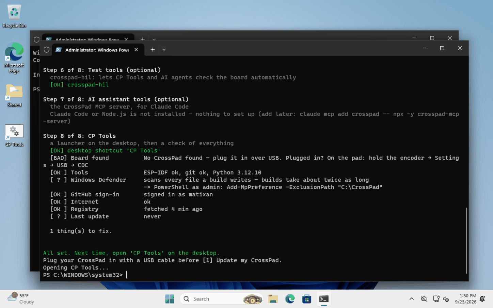
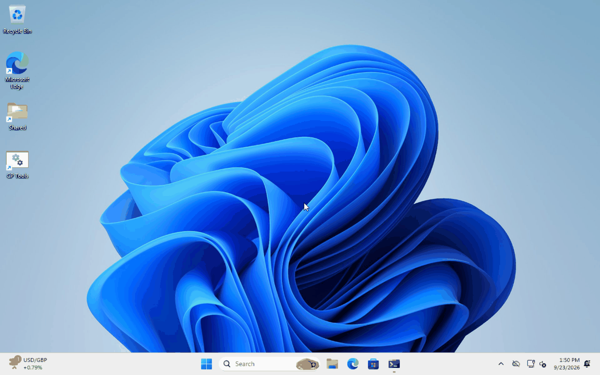
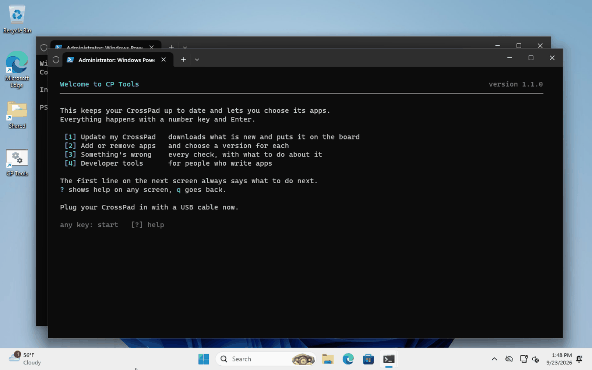
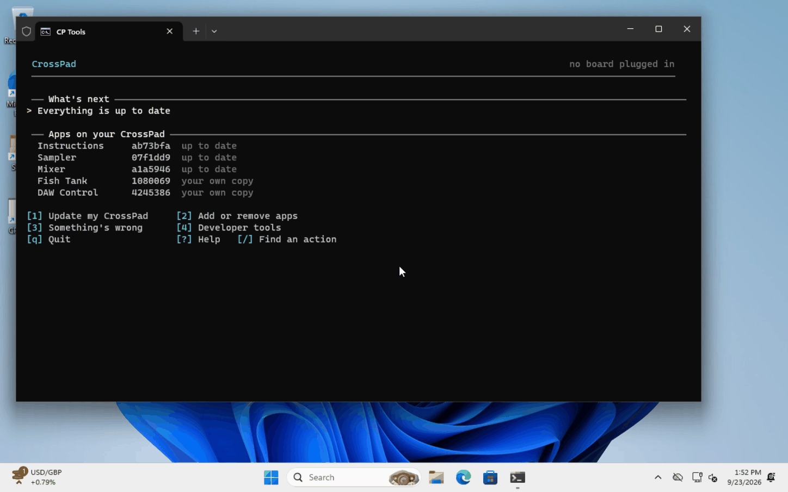
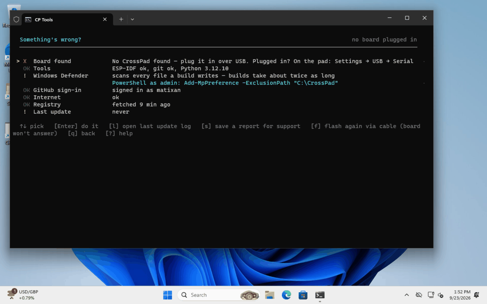

# Install the CrossPad tools

This puts everything your computer needs to update your CrossPad on it, and
opens **CP Tools** — the program that updates the CrossPad and chooses its apps.

**You need:**

- a Windows, Mac or Linux computer with about **10 GB free**
- the **USB-C cable** of your CrossPad
- a **GitHub account** that has access to CrossPad (ask on the CrossPad Discord
  with your GitHub user name if you don't have access yet)
- **30 minutes** the first time (mostly waiting for downloads)

You type one line. Everything else happens by itself.

---

## Windows

### 1. Open PowerShell

Click **Start**, type `powershell`, and click **Windows PowerShell**.



### 2. Paste the install line

Copy this line, click into the blue/black PowerShell window, **right-click** to
paste, and press **Enter**:

```powershell
powershell -ExecutionPolicy Bypass -c "irm https://raw.githubusercontent.com/CrossPad/crosspad-apps/main/install/install.ps1 | iex"
```



Paste it into **PowerShell**, not into the *Run* box (Win+R): Windows Defender
treats a PowerShell line pasted there as an attack ("ClickFix") and stops it.

### 2½. Two questions: PC and Arduino

Right at the start the installer asks whether to also set up the **PC
simulator** (the CrossPad on your computer's screen) and the **Arduino**
version of the firmware. Press **Enter** for *no* if you only want to update
your CrossPad — you can run the install line again later and answer *y*.

### 3. Sign in to GitHub (once)

Early on (step 2) the installer shows a **one-time code** — it is already
copied for you. Press **Enter**: your browser opens GitHub. Sign in if it asks,
press **Ctrl+V** to paste the code, and click **Continue**, then
**Authorize**. Come back to the PowerShell window — it carries on by itself.
Next time it remembers you.



### 4. Wait while the steps tick by

The installer works through 10 steps (12 with the PC and Arduino extras). Each one ends with a green **[OK]**. The
longest is step 4, ESP-IDF — about 15 minutes. **An ESP-IDF 5.5 you already
have** (from the VS Code extension, the Espressif installer, or your own
folder) is found and used as it is; one of another version is left alone and
5.5 goes next to it. The installer also sets up **VS Code** (with the ESP-IDF
extension and the CP Tools buttons, pointed at the right ESP-IDF) and
**Node.js** with the CrossPad MCP server for AI assistants (VS Code and Claude
Code), and checks at the end that every command below works in a new
terminal. You can leave the window alone.

![Steps 1 and 2 finished with [OK], step 3 working](img/win-3-steps.png)

### 5. "All set"

The installer checks everything once more and prints **All set**, then opens
CP Tools. A line that says *No CrossPad found* only means the board is not
plugged in yet.



### 6. Open CP Tools

From now on, open **CP Tools** from the shortcut on your desktop.



---

## Mac and Linux

1. Open **Terminal** (Mac: press ⌘ Space, type `terminal`, Enter).
2. Paste this line and press **Enter**:

   ```bash
   curl -fsSL https://raw.githubusercontent.com/CrossPad/crosspad-apps/main/install/install.sh | bash
   ```

3. Type your computer password when asked (it installs a few system tools).
   On a Mac, if a window asks to install the *Command Line Tools*, click
   **Install**, wait, then paste the line again.
4. Sign in to GitHub when the code appears (same as step 3 above).
5. Wait for **All set**. It looks like this:

   ```
   Step 4 of 10: ESP-IDF 5.5
     the compiler for the CrossPad's chip — about 10 minutes the first time
     found your ESP-IDF 5.5.4 at /home/you/esp/esp-idf — using it as it is
     ✓ ESP-IDF v5.5.4 at /home/you/esp/esp-idf

   Step 5 of 10: USB access
     so the tools can talk to the board
     ✓ added — log out and back in once for it to take effect
   …
   All set. Next time, open a terminal and type:  cptools
   Plug your CrossPad in with a USB cable before [1] Update my CrossPad.
   ```

6. From now on, open a terminal and type `cptools`.

On Linux, **log out and back in once** after the first install, so your user
may talk to USB devices.

---

## Commands you get

Every command works in any new terminal (PowerShell, cmd, Terminal) — no
`export.sh`, no paths to remember. Each one sets up ESP-IDF by itself.

| Command | What it does |
|---|---|
| `cptools` | CP Tools. Also `cptools doctor`, `cptools update-board`, `cptools support` |
| `crosspad-flash` | put the last build on the board over USB |
| `crosspad-files` | files on the board: `crosspad-files ls /sdcard`, `push`, `pull`, `assets` |
| `crosspad-board` | which board version is plugged in |
| `crosspad-idf` | `idf.py` for the project, e.g. `crosspad-idf build` |
| `crosspad-hil` | the board's test tools, e.g. `crosspad-hil devices` |
| `crosspad-bench` | the developer bench: `check`, `ready`, `flash`, `test smoke` |
| `crosspad-sim`, `crosspad-pc` | the PC simulator and its app manager (if you said yes to it) |
| `crosspad-arduino`, `pio` | the Arduino version's app manager and PlatformIO (if you said yes to it) |

**VS Code:** open the `CrossPad` folder. The ESP-IDF extension already knows
where ESP-IDF is, and `.vscode/mcp.json` gives Copilot the CrossPad MCP server.
Claude Code gets the same server (`claude mcp list` shows `crosspad`).

---

## The first time in CP Tools

CP Tools greets you once and explains its four keys:



Then the first screen. **The top line always tells you what to do next.**
Plug your CrossPad in and press **1** to put the newest version on it.



- **1** Update my CrossPad — downloads, builds and puts it on the board
- **2** Add or remove apps
- **3** Something's wrong — every check, with what to do about it
- **?** help on any screen · **q** back

---

## If something goes wrong

- **Run the install line again.** It only redoes what is missing or broken,
  and never overwrites your own changes.
- In CP Tools press **3** (*Something's wrong*). Every red line says what to do.
- Still stuck? In *Something's wrong* press **s**. It saves one file with
  everything a helper needs (no passwords). Send it on the CrossPad Discord,
  channel **#support**, with one line about what you were doing.



<details>
<summary>Options for people who know what they are doing</summary>

Set these before running the install line:

| Variable | Default | What |
|---|---|---|
| `CROSSPAD_DIR` | `C:\CrossPad`, `~/CrossPad` | where the project goes (no spaces) |
| `CROSSPAD_BRANCH` | `crosspad_v20` | branch of CrossPad/platform-idf |
| `CROSSPAD_IDF_DIR` | an ESP-IDF 5.5 already here, else `C:\esp\esp-idf`, `~/esp/esp-idf` | which ESP-IDF to use or where it goes |
| `CROSSPAD_WITH_PC=1`, `CROSSPAD_WITH_ARDUINO=1` | | set up the PC simulator / the Arduino version without asking |
| `CROSSPAD_PC_DIR`, `CROSSPAD_ARDUINO_DIR` | `C:\CrossPad-PC`, `~/CrossPad-PC`; `C:\CrossPad-Arduino`, `~/CrossPad-Arduino` | where they go |
| `CROSSPAD_YES=1` | | answer yes to every question (the PC and Arduino extras stay off) |
| `CROSSPAD_NO_HIL=1`, `CROSSPAD_NO_VSCODE=1`, `CROSSPAD_NO_MCP=1`, `CROSSPAD_NO_TUI=1` | | skip the test tools, VS Code, the AI-assistant tools, or opening CP Tools at the end |

Windows installs everything for your user only (no administrator needed) and
keeps to short folders, because ESP-IDF cannot build in paths with spaces or
non-English letters.
</details>
